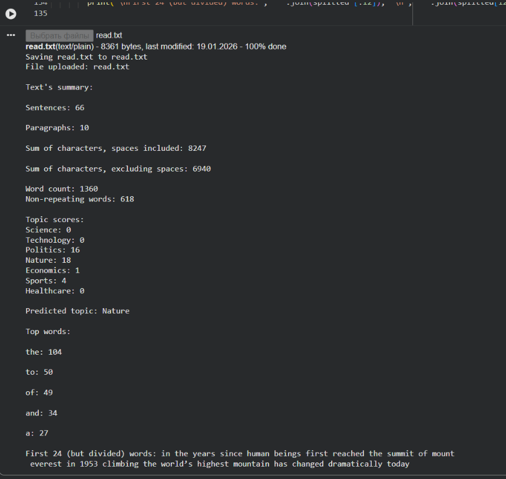

# Text Analyzer (Colab)

Python mini-project built in Google Colab.  

The program reads a `.txt` file and prints basic text statistics, top frequent words, and a simple topic prediction (keyword scoring).

## Features
- Load text from a `.txt` file in Colab
- Count characters (with and without spaces)
- Count sentences and paragraphs
- Count words and unique words
- Top frequent words
- Topic prediction using keyword score dictionary

## How to run (Google Colab)
1. Open the notebook: `Text-analyzer-colab.ipynb`
2. Upload your `.txt` file when prompted
3. Run all cells

## Notes
- This repository does not include copyrighted article text. Use your own `.txt` file.

## Example output

